## Table of Contents

- [What is the EezBotFun 8-Key MacroPad?](#what-is-the-eezbotfun-8-key-macropad)
- [Why EezOpen?](#why-eezopen)
- [Highlights](#highlights)
- [Profiles and MacroPad synchronization](#profiles-and-macropad-synchronization)
- [Key configuration](#key-configuration)
  - [HID Mode](#hid-mode)
  - [Linux-side actions](#linux-side-actions)
- [External Scripts](#external-scripts)
- [Key icons](#key-icons)
- [RGB backlight](#rgb-backlight)
- [MacroPad theme](#macropad-theme)
- [Custom background images](#custom-background-images)
- [Screen Scripts](#screen-scripts)
  - [EezTop](#eeztop)
  - [EezNet](#eeznet)
  - [EezOBS Monitor](#eezobs-monitor)
- [Firmware update](#firmware-update)
- [Safe Mode](#safe-mode)
- [Architecture](#architecture)
- [Ubuntu / Debian](#ubuntu--debian)
  - [Logs](#logs)
- [Optional dependencies for example scripts](#optional-dependencies-for-example-scripts)
  - [EezOBS Monitor setup](#eezobs-monitor-1)
- [Basic usage](#basic-usage)
- [Security model](#security-model)
- [Compatibility and project scope](#compatibility-and-project-scope)
- [Technical notes](#technical-notes)
- [Security and Blue-Team Assessment](#security-and-blue-team-assessment)
  - [Scope, EezOpen and responsibility](#scope-eezopen-and-responsibility)
  - [Assessment scope](#assessment-scope)
  - [Vendor-provided context](#vendor-provided-context)
  - [USB interfaces](#usb-interfaces)
  - [BadUSB / automatic HID injection](#badusb--automatic-hid-injection)
  - [Official Configurator](#official-configurator)
  - [PC monitoring component](#pc-monitoring-component)
  - [Host-side execution and trust boundaries](#host-side-execution-and-trust-boundaries)
  - [Web Configurator and network traffic](#web-configurator-and-network-traffic)
  - [Firmware](#firmware)
  - [Firmware update behavior](#firmware-update-behavior)
  - [Current assessment](#current-assessment)
  - [Remaining areas of interest](#remaining-areas-of-interest)
- [Contributing](#contributing)
- [Project relationship](#project-relationship)
- [License](#license)

<h1 align="center">EezOpen</h1>

<p align="center">
  <strong>A Linux-native open-source companion for the EezBotFun 8-Key MacroPad.</strong>
</p>

<p align="center">
  Configure keys and profiles, manage RGB and backgrounds, run Linux-side actions,
  update firmware, and turn the MacroPad display into a live Linux/OBS dashboard.
</p>

> [!NOTE]
> EezOpen is an independent community project. It is not the official EezBotFun configurator and is not currently affiliated with EezBotFun.
> 
> The project is open source, and I would be very happy to see EezBotFun adopt, integrate, or officially support this work in the future.

<p align="center">
  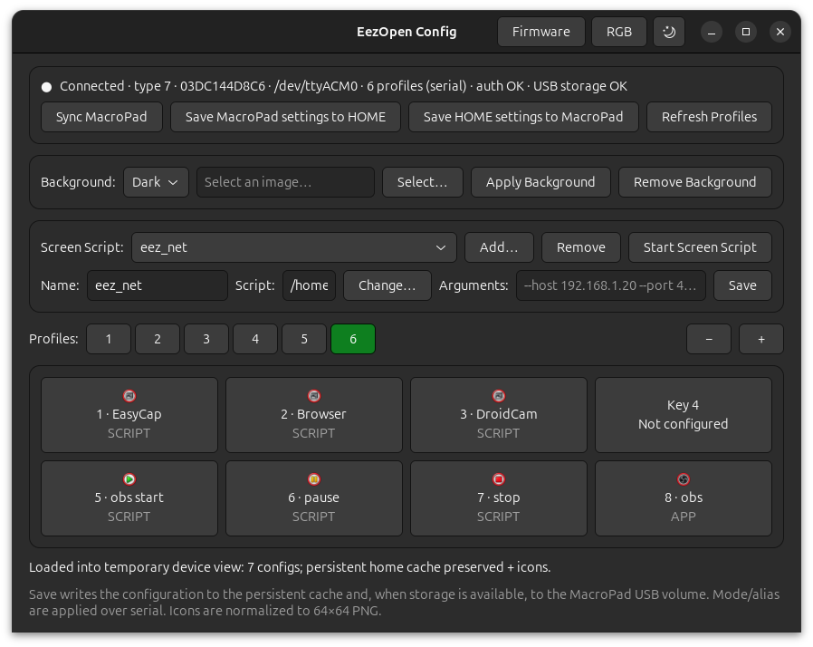
</p>


## What is the EezBotFun 8-Key MacroPad?

The [EezBotFun 8-Key MacroPad](https://www.eezbotfun.com/en/8-key-macropad-with-screen) is a programmable desktop control device built around eight hot-swappable mechanical keys, RGB backlighting, a scroll wheel, and a 3.5-inch 480×320 color LCD.

It can work as a standard USB HID device for keyboard-style actions, while its screen can display key icons, profiles, system information, and custom graphics. EezBotFun also provides browser-based configuration and documentation for Windows, macOS, and Linux.

Useful official links:

- [EezBotFun website](https://www.eezbotfun.com)
- [8-Key MacroPad product page](https://www.eezbotfun.com/en/8-key-macropad-with-screen)
- [8-Key MacroPad user manual](https://www.eezbotfun.com/en/wiki/8-key-macro-pad-user-manual)


<br />

## Why EezOpen?

The EezBotFun MacroPad already works on Linux as a standard HID device, and EezBotFun provides both a web configurator and an official desktop
configuration application.

At the time of writing, the latest official desktop Config App release is **v1.8.3**.

EezOpen was created to provide a **native, local and inspectable Linux desktop experience** for the MacroPad while remaining compatible with the device's existing configuration files and confirmed firmware behavior.

The goal is not simply to replace the official configurator. EezOpen brings the device's normal configuration workflow to a Linux-native GTK4 application
and extends it with additional Linux integrations.

It supports many of the device-management tasks users expect from a configurator, including profiles, key configuration, custom icons, RGB
configuration, theme switching, configuration synchronization and firmware updates.

On top of that, EezOpen adds Linux-oriented features such as:

- **Host-side scripts and executables** — MacroPad keys can launch programs and scripts directly on the Linux host, with command-line arguments. This
  can include Bash scripts, Python programs, compiled Go or C applications, and other executables available on the system.

- **External application integration** — keys can interact with applications running on the Linux desktop. For example, the included OBS example can
  change scenes, start or stop recording, pause recording and control audio sources through OBS WebSocket.

- **Custom MacroPad backgrounds** — EezOpen can convert a normal image into the format used by the MacroPad and install it as the device background.

- **Managed Screen Scripts** — long-running programs can draw custom, real-time information directly on the MacroPad LCD.

  Screen Scripts are managed by the EezOpen daemon, and multiple scripts can be registered in the Configurator with their own names and command-line
  arguments.

- **Screen Scripts without losing daemon functionality** — while a custom Screen Script controls the display, the EezOpen daemon remains active.
  Host-side key actions and other daemon-dependent features can continue working while EezOpen pauses only its own display telemetry to avoid 
  overwriting the custom screen.

- **Linux monitoring examples** — EezOpen includes display applications such as **EezTop**, **EezNet** and **EezOBS Monitor**, demonstrating how the
  MacroPad LCD can be used as a small real-time Linux dashboard rather than only as a static key display.

EezOpen also follows a conservative approach when interacting with the hardware. Device commands and file formats are implemented only when supported by physical testing, USB or serial captures, official documentation, or analysis of the official configurator.

The result is a Linux companion that keeps the original MacroPad experience while opening the device to deeper desktop automation, scripting and custom display applications.


<br />

## Highlights

EezOpen currently provides:

- Native GTK4 configuration on Linux
- Linux-side Non-HID actions
- External scripts with command-line arguments
- RGB color and animation controls
- Dark/light device theme switching
- Custom MacroPad background images
- Firmware update workflow
- Explicit MacroPad ↔ HOME configuration synchronization
- Safe Mode awareness
- Built-in PC monitoring support
- Managed Screen Scripts for live LCD applications
- Example Linux monitors: **EezTop**, **EezNet**, and **EezOBS Monitor**


<br />

## Profiles and MacroPad synchronization

EezOpen keeps a persistent configuration cache in the user's home directory and provides explicit synchronization controls instead of silently replacing local data when the device connects.

The main synchronization directions are:

```text
Sync MacroPad
    MacroPad -> temporary device view

Save MacroPad settings to HOME
    MacroPad -> persistent EezOpen configuration

Save HOME settings to MacroPad
    persistent EezOpen configuration -> MacroPad
```

Profiles can be created, removed, selected, and synchronized with the physical device.

<p align="center">
  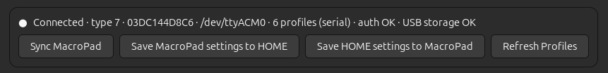
</p>


<br />

## Key configuration

Each of the eight keys can be configured from the GTK interface.

<p align="center">
  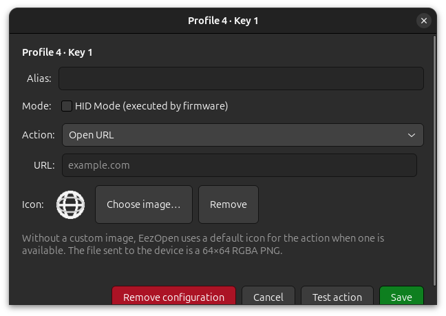
</p>

EezOpen supports both firmware-executed HID actions and Linux-side host actions.


<br />

### HID Mode

HID actions are written to the MacroPad configuration and executed by the firmware. The current editor supports:

- Shortcuts
- Individual keys
- Text input
- Delays / waits
- Supported media-key tokens

<p align="center">
  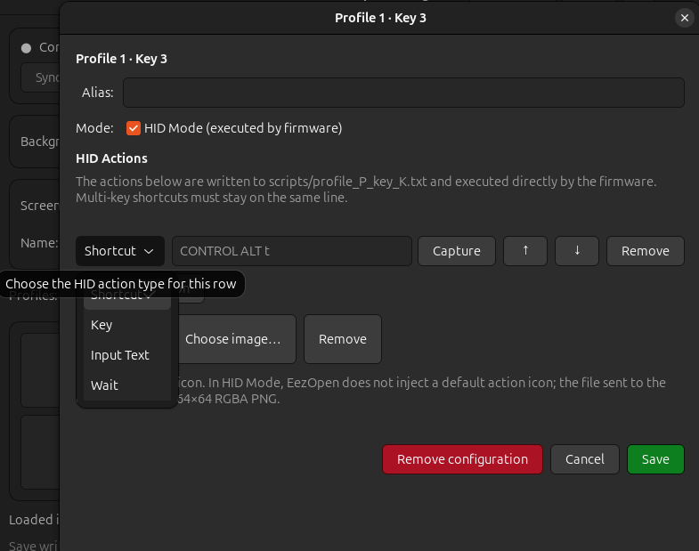
</p>


Multi-key shortcuts are kept on the same script line, for example:

```text
CONTROL ALT t
CONTROL E
```

This allows the MacroPad to continue behaving like a normal keyboard for firmware-side actions without requiring EezOpen to emulate keyboard input.


<br />

### Linux-side actions

For actions that need the host operating system, EezOpen can perform:

<p align="center">
  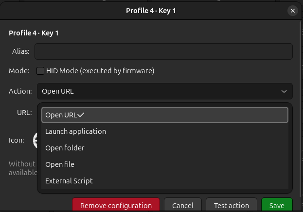
</p>

- Open URL
- Launch application or command
- Open folder
- Open file
- **Run an External Script**

These actions are executed by the EezOpen daemon as the logged-in desktop user.


<br />

## External Scripts

A key can launch an external program or script with optional command-line arguments.

<p align="center">
  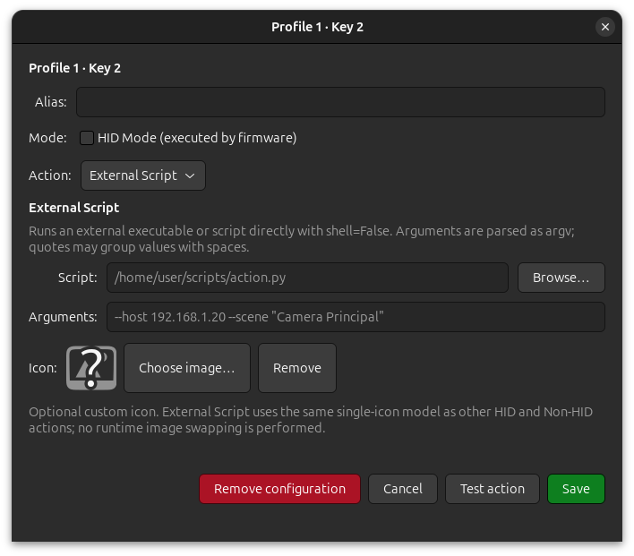
</p>


Example:

```text
Script:    /home/user/scripts/obs_control.py
Arguments: --scene Browser
```

External Scripts use direct argv execution rather than a shell. This makes them useful for integrating the MacroPad with Linux tools and applications without adding application-specific logic to the EezOpen daemon.

The repository includes `External_scripts/obs_control.py` as a simple OBS WebSocket control example.


<br />

## Key icons

Keys can use custom icons. Images selected through the configurator are normalized to the format expected by the device:

```text
64 × 64
RGBA PNG
```

EezOpen also includes default icons for common host-side actions when a custom image is not selected.

<br />

## RGB backlight

RGB color and animation mode can be configured directly from EezOpen.

<p align="center">
  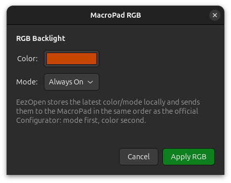
</p>

Current modes include:

- Always On
- When Pressing The Key
- Breath
- Flowing
- Always Off

<br />

## MacroPad theme

The device theme can be switched from the configurator.

<p align="center">
  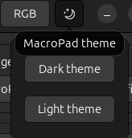
</p>

<br />

## Custom background images

EezOpen can convert a normal image into the LVGL background format used by the MacroPad and install it through the device's USB Mass Storage interface.

<p align="center">
  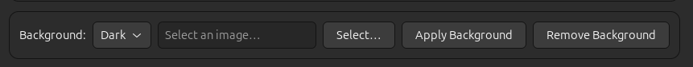
</p>

The bundled `create_bg.py` helper:

- fits the image to the MacroPad background size;
- reduces it to the palette expected by the display;
- converts it to the LVGL binary format;
- installs or removes the selected background through an explicit Configurator action.

Background access is never performed as a continuous background scan.

<br />

## Screen Scripts

Screen Scripts are long-running programs that can draw live information on the MacroPad LCD.

Multiple scripts can be saved in the configurator, each with:

- a friendly name;
- a script path;
- command-line arguments.

Only one Screen Script can run at a time.

<p align="center">
  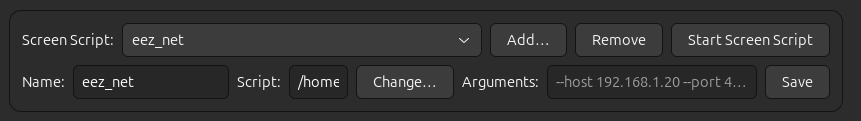
</p>

While a Screen Script is running, EezOpen keeps its normal serial connection and key-event handling active. The daemon pauses its own PC Monitor display telemetry so that it does not overwrite the custom Screen Script display.

Python Screen Scripts are started with the current Python interpreter. Other files must be executable. Arguments are parsed with argv semantics and no shell is used.

<br />

### EezTop

`External_scripts/EezTop.py` turns the LCD into a compact Linux system monitor with CPU, memory, temperature, uptime, load averages, and active processes.

<p align="center">
  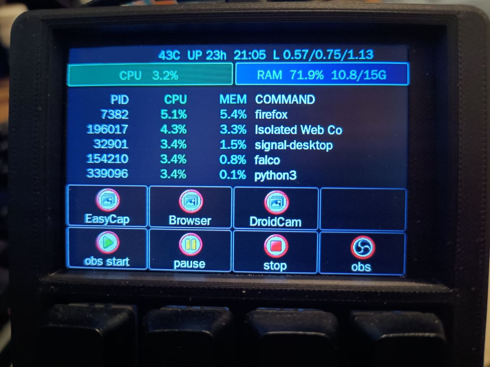
</p>

<br />

### EezNet

`External_scripts/eez_net.py` provides live network monitoring, including interface information, RX/TX rates, packet counters, errors, drops, and TCP connection information.

<p align="center">
  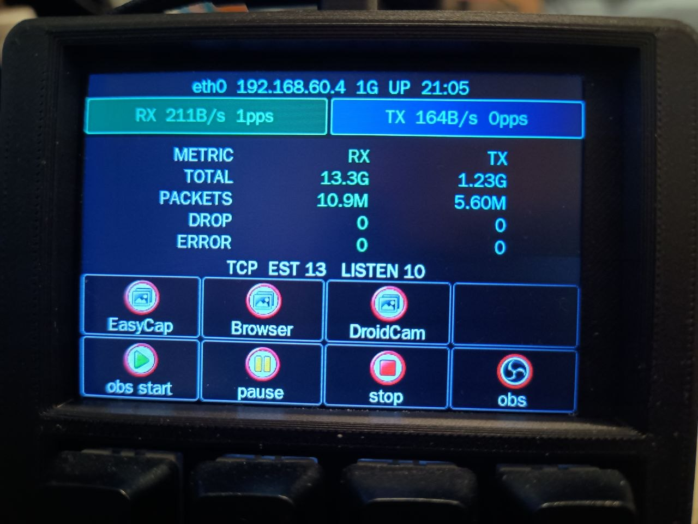
</p>

<br />

### EezOBS Monitor

`External_scripts/EezOBSMonitor.py` uses the OBS WebSocket API to display streaming and recording information directly on the MacroPad LCD, including:

- current scene;
- recording state;
- pause state;
- recording timer;
- multiple OBS audio-source mute states.

At the same time, the physical MacroPad keys can remain configured for OBS actions such as changing scenes, starting, pausing or stopping a recording, and controlling audio sources.

This is a good example of one of the main EezOpen features: a Screen Script can continuously update the LCD while daemon-dependent key actions continue to work normally.

<p align="center">
  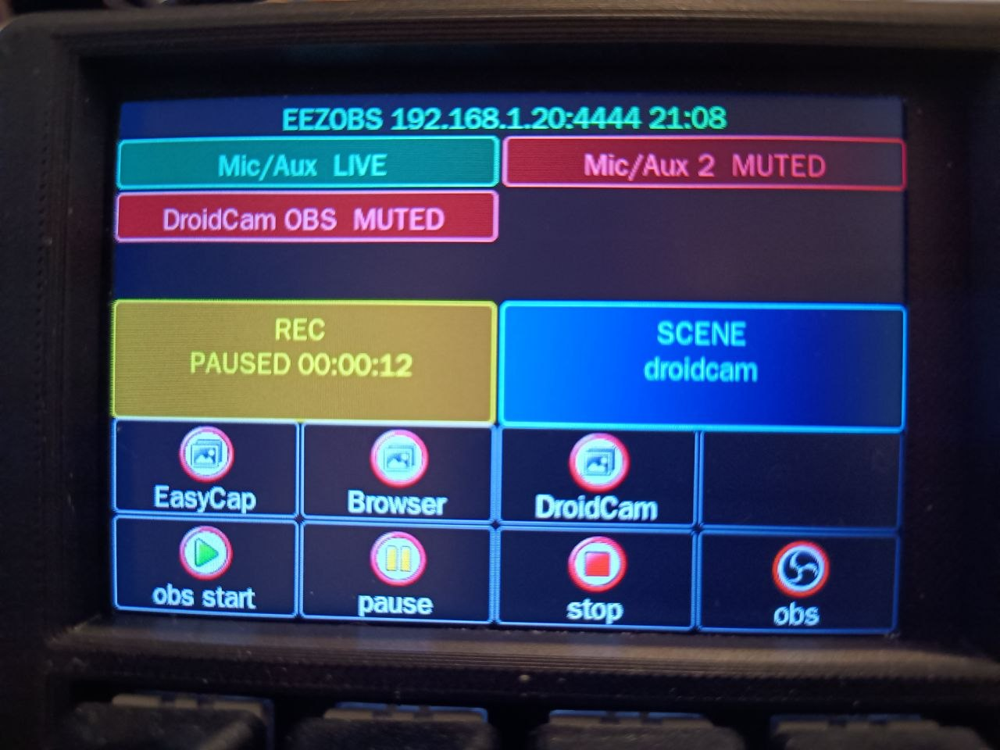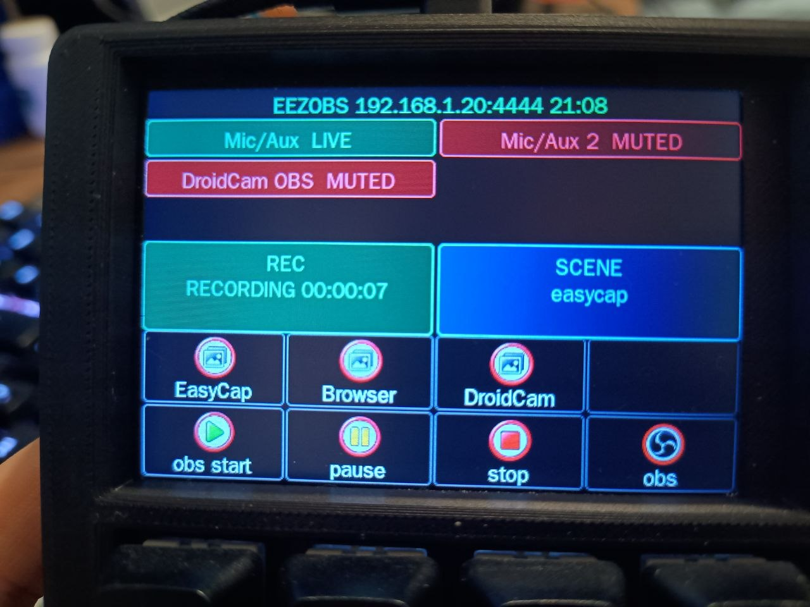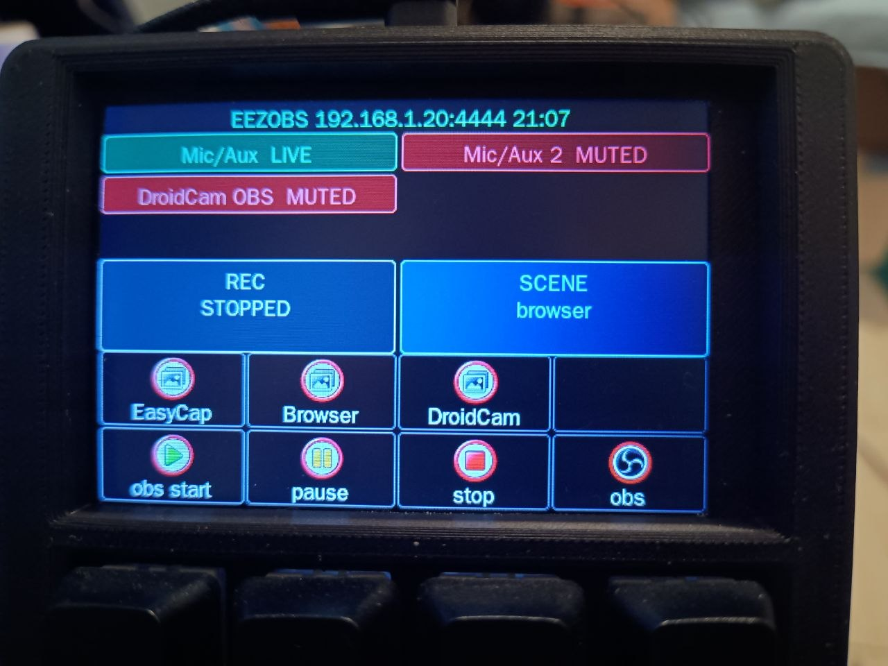
</p>

> EezOBS Monitor requires the `obsws-python` package and an OBS WebSocket connection.

<br />

## Firmware update

The configurator includes a firmware-update workflow for matching BIN and JSON firmware files.

<p align="center">
  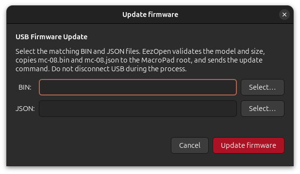
</p>

EezOpen validates the selected files, copies the required update data to the device, triggers the confirmed firmware-update path, and waits for the MacroPad to return to normal runtime mode.

<br />

## Safe Mode

EezOpen understands the MacroPad firmware's Safe Mode, where USB Mass Storage is disabled while CDC/HID runtime functionality remains available.

In Safe Mode, storage-dependent operations are disabled or explained in the UI, while supported serial/HID features can continue to operate.

<br />

# Architecture

EezOpen is split into two main components:

```text
┌──────────────────────┐
│  eezopen-config      │
│  GTK4 Configurator   │
└──────────┬───────────┘
           │ local Unix socket
           ▼
┌──────────────────────┐
│  eezopen-daemon      │
│  user-session daemon │
└──────────┬───────────┘
           │ USB CDC / Mass Storage
           ▼
┌──────────────────────┐
│  EezBotFun MacroPad  │
└──────────────────────┘
```

The daemon owns the normal device communication and performs host-side actions. The Configurator communicates with the daemon through a user-private Unix socket.

EezOpen was intentionally designed to run entirely inside the logged-in user's session. Both the daemon and the GTK4 Configurator run as the desktop user, and the daemon is managed through a `systemd --user` service.

Running EezOpen as root is neither required nor recommended. Elevated privileges are only needed during system-level setup, such as installing udev rules, adding the user to the appropriate serial-access group (for example `dialout`), or installing distribution packages.

Once the system is configured, normal communication with the MacroPad, host-side actions, Screen Scripts, configuration management, and the Configurator all run with the permissions of the logged-in user.

Persistent per-device data is kept under:

```text
~/.local/share/EezOpen/
```

<br />

# Ubuntu / Debian

Install the main runtime dependencies:

```bash
sudo apt install \
    python3-gi \
    gir1.2-gtk-4.0 \
    python3-pil \
    xdg-utils \
    udisks2
```

| Package | Used by | Purpose | Required? |
|---|---|---|---|
| `python3-gi` | EezOpen Configurator | Provides the Python GObject Introspection bindings used by the GTK4 interface. | **Required for the Configurator** |
| `gir1.2-gtk-4.0` | EezOpen Configurator | Provides the GTK4 introspection definitions required by `python3-gi` to build and display the graphical interface. | **Required for the Configurator** |
| `python3-pil` | Background image feature / `create_bg.py` | Provides Pillow (`PIL`), used to resize, process and convert normal image files into the format expected by the MacroPad background. | Optional, required for custom backgrounds |
| `xdg-utils` | EezOpen daemon / host-side actions | Provides `xdg-open`, used by actions such as **Open URL**, **Open File**, and **Open Folder**. | Optional, required for these host-side actions |
| `udisks2` | EezOpen daemon / USB Mass Storage operations | Provides `udisksctl`, which EezOpen uses to automatically mount the MacroPad USB Mass Storage when an operation needs access to device files. Used by configuration synchronization, background management and firmware updates. | Recommended; not required if the device storage is already mounted |
| `python3-serial` | Screen Scripts and external tools | Provides PySerial, used by scripts that communicate directly with the MacroPad CDC serial interface, such as the bundled display/monitoring examples. The main EezOpen daemon uses the Linux serial interface directly and does not depend on PySerial. | Optional, required by compatible Screen Scripts |

Clone or download the repository and run the installer as your **normal desktop user**:

```bash
chmod +x install.sh
./install.sh
```

Do **not** run `install.sh` as root.

The installer places the main components under the user's home directory and uses the standard Linux `dialout` group for CDC serial access.

If the installer adds your account to `dialout`, log out and back in so the graphical session and the systemd user manager receive the new group membership.

Then enable and start the daemon:

```bash
systemctl --user enable --now eezopen.service
```

After installation, you can open the Configurator either from your desktop application menu by searching for **EezOpen**, or directly from a terminal:

```bash
~/.local/bin/eezopen-config

```

The desktop launcher and the CLI command start the same GTK4 Configurator.

<br />

## Logs

Follow daemon logs with:

```bash
journalctl --user -u eezopen.service -f
```

Managed Screen Script stdout/stderr is written to:

```text
~/.local/share/EezOpen/screen-script.log
```

<br />

# Optional dependencies for example scripts

The example Screen Scripts communicate directly with the MacroPad's customised-display protocol and may require PySerial:

```bash
sudo apt install python3-serial
```

<br />

### EezOBS Monitor

Install the OBS WebSocket Python client:

```bash
pip install obsws-python
````

EezOBS Monitor also requires the OBS WebSocket server to be enabled and configured in OBS.

In OBS, open:

```text
Tools → WebSocket Server Settings
```

Then:

* enable the WebSocket server;
* choose or confirm the listening port;
* configure authentication/password if desired;
* use the same host, port and password in `EezOBSMonitor.py`.

The OBS host, port, password, and monitored audio inputs should be configured for your environment.

For example:

```text
Host:     192.168.1.20
Port:     4455
Password: your-password
```

The computer running EezOBS Monitor must be able to reach the OBS WebSocket server over the network.

<br />

# Basic usage

1. Connect the EezBotFun 8-Key MacroPad over USB.
2. Start the EezOpen daemon.
3. Open the EezOpen Configurator.
4. Use **Sync MacroPad** to refresh the temporary view of the connected device.
5. Select a profile and click a key to configure it.
6. Choose HID Mode for firmware-executed keyboard actions, or select a Linux-side action.
7. Choose a custom icon if desired.
8. Save the key.
9. Use **Save MacroPad settings to HOME** when you want the physical device configuration copied into EezOpen's persistent cache.
10. Use **Save HOME settings to MacroPad** when you want the persistent EezOpen configuration written back to the device.

For live display applications, add a Screen Script, configure its arguments, save it, and click **Start Screen Script**.

<br />

# Security model

EezOpen intentionally runs as the logged-in user rather than as a privileged system daemon.

Important boundaries:

- the GTK configurator and daemon run in the user session;
- the local IPC socket is user-private;
- host-side actions run with the logged-in user's permissions;
- External Scripts and Screen Scripts are explicitly selected by the user;
- script arguments are executed directly without an intermediate shell;
- the installer does not install a permanent EezOpen-specific USB authorization/unbind rule;
- USB Mass Storage reads are driven by explicit workflows rather than continuous background scanning.

Because External Scripts can execute arbitrary programs selected by the user, review scripts before assigning them to MacroPad keys.

<br />

# Compatibility and project scope

EezOpen is currently focused on the **EezBotFun 8-Key MacroPad with screen** and on Linux desktop systems with GTK4.

Ubuntu/Debian installation commands are provided above. Other Linux distributions may work with equivalent GTK4, PyGObject, systemd-user, udisks2, and desktop integration packages.

EezOpen intentionally does not emulate HID keyboard actions on the host. HID actions remain firmware-side whenever possible.

<br />

# Technical notes

A more detailed implementation-oriented document is included in:

[`README_EezOpen_EezBotFun.md`](README_EezOpen_EezBotFun.md)

It contains protocol notes, synchronization details, storage behavior, key-file layout, and implementation boundaries.

<br />

<br />

# Security and Blue-Team Assessment

Because the EezBotFun MacroPad is a programmable USB device capable of exposing HID, serial and Mass Storage interfaces, I wanted to better understand what the device and its software actually do before using it as part of my normal Linux desktop environment.

This section documents a practical blue-team oriented assessment of the device, the official EezBotFun configuration software, firmware, Web Configurator and surrounding update/network infrastructure.

> [!IMPORTANT]
> This is not a formal security certification, penetration test report, or proof that the device, firmware or software is free from vulnerabilities, malicious behavior or implementation flaws.
>
> The conclusions below describe only what was observed during the tests performed so far and should not be interpreted as a guarantee of present or future security.

<br />

> [!NOTE]
> All firmware-related observations in this assessment were performed using `mc-08.bin` for the `mc-08` device, corresponding to MacroPad firmware
> version **36**, as identified by `mc-08.json` (`{"version":36,"size":1452160,"device":"mc-08"}`).
>
> The exact files tested had the following SHA-256 hashes:
>
> - `mc-08.bin`: `6e287c1c04835430551896dd5a70fad04fdad42e2bf71487225ffb9347fd6a05`
> - `mc-08.json`: `e3c18f5c315a3cfb96761d6bc342c7395ed6a5bd09b5c7fedaa71841fdb96e8e`

<br />

## Scope, EezOpen and responsibility

This security assessment covers **official EezBotFun components and services**, including the MacroPad hardware behavior, firmware, official configuration software, Web Configurator, USB interfaces and observed network/update behavior.

It does **not** constitute a security audit of the EezOpen source code or a formal assessment of every possible behavior of EezOpen.

EezOpen itself is fully open source, which allows users, researchers and other developers to inspect, audit and review its implementation independently.

Anyone relying on EezOpen for security-sensitive environments is encouraged to review the source code and build or package it from trusted sources.

The availability of the EezOpen source code does not, however, eliminate risks that originate outside EezOpen. In particular, EezOpen communicates with and depends on behavior implemented by the EezBotFun hardware and firmware. The device firmware is a separate component maintained by EezBotFun and is not part of the EezOpen source tree.

Therefore, EezOpen cannot guarantee the behavior, security, integrity or future behavior of the MacroPad firmware, boot/recovery environment, firmware update mechanisms or other third-party components.

Security observations documented here are also **version-specific and time-specific**. A different hardware revision, firmware version, Configurator release, Web Configurator version or backend implementation may behave differently from the components tested during this assessment.

EezOpen is provided **as-is and without warranty**, as described in the project's license. Use of EezOpen, the MacroPad, firmware updates, external scripts, third-party presets and related integrations is at the user's own risk.

To the maximum extent permitted by applicable law, the EezOpen author and contributors are not responsible for loss of data, hardware damage, software damage, security incidents, service interruption, unexpected device behavior or other damages resulting from the use of EezOpen, the EezBotFun MacroPad, third-party firmware, third-party software or related integrations.

Nothing in this assessment should be interpreted as a warranty, certification, endorsement or guarantee of the security of EezBotFun products.

EezOpen is an independent community project and is not currently affiliated with or maintained by EezBotFun.

<br />

## Assessment scope

The analysis currently covers:

- USB enumeration and interface behavior;
- HID activity;
- CDC serial communication;
- USB Mass Storage behavior;
- the official Linux Configurator;
- the Web Configurator;
- network traffic generated while using the official services;
- firmware update behavior;
- static inspection of the available firmware images;
- controlled observation of the MacroPad while idle and while performing expected actions.

The device was intentionally tested with restricted access whenever possible. HID, serial communication and Mass Storage were enabled selectively so that the behavior of each interface could be observed independently.

<br />

## Vendor-provided context

During the assessment, EezBotFun was contacted and provided additional technical context about the device architecture and its security model.

According to EezBotFun:

- the firmware is **not open source**;
- the Web Configurator is open source and exposes the same device communication protocol used by the desktop configuration applications;
- configuration commands are received through the USB serial interface;
- key icons are transferred through the MacroPad USB Mass Storage and stored in the device's `app_icons` directory;
- scripts are stored in the device's `scripts` directory;
- when a physical key is pressed, the firmware executes the corresponding script;
- RGB lighting and related visual effects are handled by the firmware;
- the PC monitoring functionality uses a separate host-side component, and the relevant plugin source code and integration protocol are publicly available.

EezBotFun also explicitly welcomed independent security review of the product.

These statements are useful architectural context, but they are treated separately from independently observed behavior. Where possible, the assessment below distinguishes between vendor-provided information and findings reproduced during testing.

<br />

## USB interfaces

The tested MacroPad exposes multiple USB functions:

| Interface | Observed purpose |
|---|---|
| HID | Keyboard, mouse and media-control events |
| CDC Serial | Device configuration, events and display communication |
| USB Mass Storage | Profiles, configuration files, icons and firmware-related files |

<br />

During a monitored idle period immediately after USB enumeration, no unsolicited HID input reports were observed.

Manual key interaction subsequently produced the expected HID reports. No automatic key injection or unexpected CDC traffic was observed during the controlled idle tests.

This does **not** prove that unexpected behavior is impossible; it only means that none was observed during the monitored test periods.

<br />

## BadUSB / automatic HID injection

One of the main concerns with programmable USB devices is BadUSB-style behavior, where a device silently presents itself as a keyboard and injects commands into the host.

During the tests performed so far:

- no automatic keystroke injection was observed;
- no unexpected HID reports were generated while the MacroPad was idle;
- HID events generated after pressing physical keys matched the expected device behavior;
- no unexpected serial commands were observed while the device was idle.

So far, there is no observed evidence of BadUSB-style automatic command injection. Longer-term observation and testing of additional firmware versions would still be useful.

<br />

## Official Configurator

The official Linux Configurator was also inspected. The application communicates with the MacroPad through the same general serial configuration protocol exposed by the open-source Web Configurator.

EezBotFun states that the desktop applications primarily provide a more convenient interface for creating and managing device scripts, while the resulting scripts can also be copied directly to the MacroPad's `/scripts` directory without the desktop application being responsible for executing them.

During independent testing, the serial protocol was observed using frames beginning with `ebf`, followed by a length field and an ASCII command payload.

The analysis did not identify obvious behavior such as:

- reverse shells;
- hidden shell execution;
- silent use of `curl` or `wget`;
- unexpected Python or shell execution;
- obvious command-and-control endpoints;
- a hidden Linux auto-updater replacing the Configurator binary.

The application also avoids running its main process as root, which is a positive design decision.

<br />

## PC monitoring component

The PC monitoring is architecturally different from normal MacroPad firmware-side actions because it requires access to operating-system information.

EezBotFun states that the PC monitoring functionality uses third-party open-source components and that the relevant plugin source code is published in accordance with the applicable MPL licensing requirements.

The communication protocol between the PC monitoring component and the configuration application is also publicly documented.

This improves the auditability of the host-side monitoring component compared with the closed device firmware.

<br />

## Host-side execution and trust boundaries

Normal MacroPad scripts are stored on the device and executed by the firmware when a key is pressed.

Host-side functionality introduces a different trust boundary because software running on the computer may have access to files, applications, system information or external processes.

Third-party presets, plugins and scripts capable of triggering host-side code should therefore be treated as executable content rather than as harmless configuration data and should be reviewed before being imported or executed.

EezOpen also provides optional host-side functionality; however, analysis of EezOpen itself is outside the scope of this assessment. Its complete source code is publicly available for independent review.

<br />

## Web Configurator and network traffic

The official Web Configurator is hosted under the `itsmartreach.com` domain, which is referenced by the EezBotFun documentation. Observed traffic included resources belonging to the Web Configurator and connections associated with the EezBotFun website.

The EezBotFun website was also observed using a Supabase backend. The observed Supabase usage appears consistent with normal website functionality, including community/preset-related features and analytics.

During the captures performed so far, no traffic was identified that clearly indicated:

- command-and-control communication;
- covert remote device control;
- unexpected data exfiltration from the MacroPad.

These observations are limited to the traffic captured during the tests and should not be interpreted as a complete audit of the backend infrastructure.

<br />

## Firmware

The firmware itself is closed source. The tested `mc-08.bin` image could not be meaningfully inspected as normal plaintext firmware during static analysis. Tools such as Binwalk and EMBA were used, but the firmware format prevented useful inspection of the internal application logic.

EezBotFun confirmed that the firmware source code is not publicly available. The vendor states that this is a business decision related to the hardware-based business model rather than an attempt to prevent security review.

Because the firmware implementation itself is unavailable, some security-relevant behavior cannot currently be independently reviewed at source-code level.

HMAC-SHA256-related authentication between the configuration application and the device was identified during the analysis, and an encrypted firmware/update format was also observed. However, the complete firmware trust chain has not yet been independently verified.

Because the firmware image is encrypted and the firmware source code is not publicly available, the internal firmware logic could not be independently
reviewed in depth. As a result, this assessment could not independently verify:

- the internal implementation of the firmware;
- how firmware authenticity and integrity are validated;
- the exact logic used during firmware updates;
- whether different update paths perform the same validation;
- internal security controls that may exist inside the boot/recovery firmware.

The analysis was therefore limited to externally observable behavior, the documented/open communication protocols, the official configurators, USB
activity, update behavior, and network traffic.

<br />

## Firmware update behavior

Two update models have been encountered during the investigation.

Some versions of the official update workflow provide Wi-Fi credentials to the device, after which the MacroPad is expected to connect to the update
infrastructure and retrieve the firmware itself.

On the tested device and recovery firmware, this Wi-Fi-based update path did not work. No attributable network traffic from the MacroPad was observed during the attempts.

Because of this, the assessment could not determine which servers or endpoints the device firmware would contact, how the firmware download is performed over the network, or whether the Wi-Fi update path uses the same verification and validation mechanisms as the manual USB-based update path.

The tested V2 recovery environment was only successfully updated by manually placing the firmware files on the MacroPad USB Mass Storage. The tested V2 recovery environment successfully updated when the firmware files were manually placed on the MacroPad USB Mass Storage.

The exact behavior may therefore vary between hardware and firmware revisions.

<br />

## Current assessment

Based on the tests performed so far, no clear evidence of malicious or unexpected behavior has been observed in:

- normal MacroPad USB activity;
- idle HID behavior;
- CDC serial activity;
- the official Linux Configurator;
- the Web Configurator traffic observed during testing;
- normal controlled use of the device.

The behavior observed so far is consistent with the device's advertised functionality:

- HID for keyboard/media actions;
- CDC for configuration and device communication;
- USB Mass Storage for configuration assets and firmware workflows.

That said, this should **not** be interpreted as proof that the device or its software is completely secure.

<br />

## Remaining areas of interest

The main areas that still deserve deeper investigation are:

- closed/encrypted firmware;
- complete firmware signature and validation chain;
- longer-duration USB monitoring;
- automatic Wi-Fi firmware update traffic;
- backend/API behavior;
- community preset supply-chain risks;
- different hardware and firmware revisions;
- deeper inspection of the official application's plugin architecture.

The current conclusion is therefore:

> No significant security red flags were observed during the practical Linux, USB, application and network tests performed so far.
>
> Some components, particularly the encrypted firmware and firmware update trust chain, remain outside the depth of analysis required for a complete
> security assessment.

The availability of the Web Configurator source code, documented communication protocols and selected host-side plugin source code improves transparency around the configuration path, but it does not provide equivalent visibility into the closed device firmware itself.

<br />

<br />

# Contributing

Testing and contributions are welcome, especially from Linux users with the EezBotFun 8-Key MacroPad.

Useful contributions include:

- testing on different Linux distributions;
- reporting firmware/device compatibility;
- improving GTK usability;
- adding well-documented Screen Scripts;
- improving Linux integrations;
- reviewing USB/serial behavior and security;
- documenting confirmed protocol behavior.

When adding device protocol behavior, please include evidence from official documentation, physical testing, captures, or analysis of the official configurator rather than guessing undocumented commands.

<br />

# Project relationship

**EezOpen** is an independent Linux community project created by **Bruno Dias da Silva**.

**EezBotFun** and the EezBotFun MacroPad are separate from EezOpen. For official product information, firmware documentation, and vendor resources, visit:

https://www.eezbotfun.com

<br />

# License

EezOpen is released under the MIT License.

See [`LICENSE`](LICENSE) for details.
